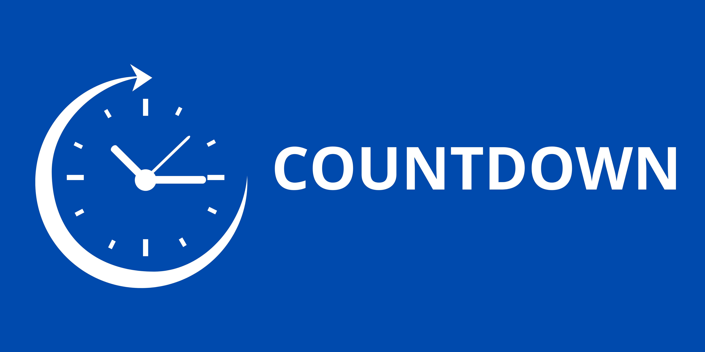
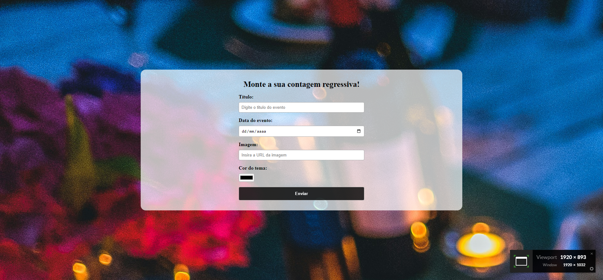

<h1 align="center">
    
    <br>
</h1>

##
📚Sobre

**Countdown** trata-se de um contador regressivo desenvolvido em ReactJS. No projeto, foram utilizadas as tecnologias Context API, custom hooks e React Router DOM para gerenciar o estado e as rotas da aplicação.

## 🏜️ Fotos do projeto
<div align="center">
    
    
</div>


## 🔨Ferramentas

- React.JS
    - React-router-dom
    - Context API
    - Custom Hook
- CSS


## Como executar o projeto
```bash
    # clone o projeto
    git clone https://github.com/matheuspeluso/countdown.git

    #entrar na pasta do projeto
    cd countdown

    #instalação das dependencias usando npm 
    npm install react-router-dom

    #para executar o sistema 
    npm run dev
    
```
## Autor do projeto
<p>Matheus Pereira Peluso do Nascimento</p>
<p>Email para contato: matheuspeluso17@gmail.com</p>
<p>Telefone para contato: +55 (21)99385-7520</p>

